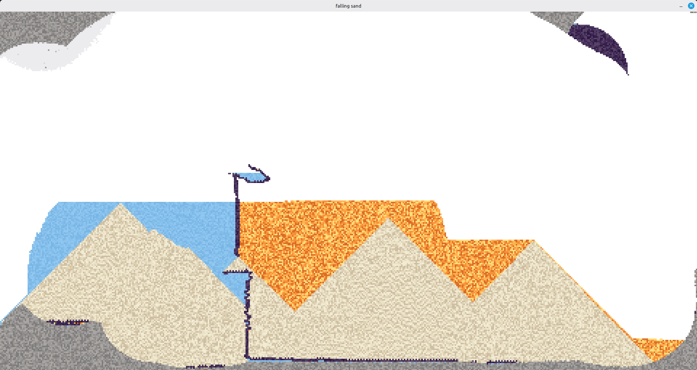
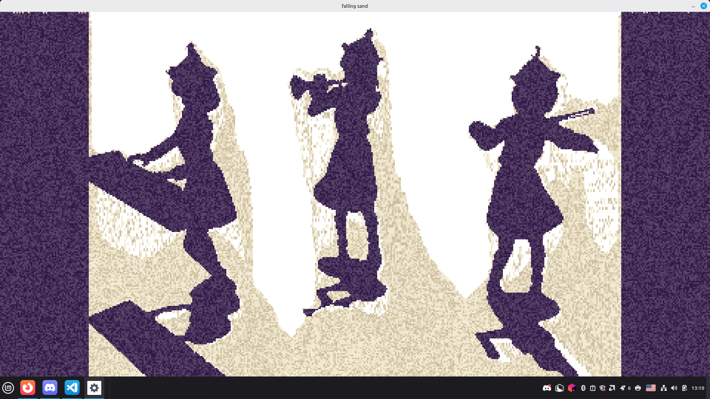

# Falling sand sim
A simple sand sim with liquids, solids, powders and gases.
Builds on gcc and clang, but not MSVC(due to VLA usage), depends on SDL3 and the vulkan sdk to build.

## Bad apple
Running with -badapple flag

## Demo
https://www.youtube.com/watch?v=aCD0BIKHDRU
## Interesting Algorithms and Techniques I learned
* I used the [Margolus neighborhood](https://en.wikipedia.org/wiki/Block_cellular_automaton) to avoid the usage of atomics and to be able to do everything in one pass. This means that any interaction can only involve at most 3 neighbours, which limits obsidian in this project to thin lines.
* I used the [pcg hash](https://en.wikipedia.org/wiki/Permuted_congruential_generator) with the pixel coordinates and frame index in order to generate random numbers on the gpu, which is used for texture variation. The obsidian in the bad apple version doesn't use the frame index in order for the texture to be deterministic and constant accross frames.
* I made use of the vulkan buffer device address extension in order to circonvent the need to use descriptors, which greatly improved my iteration speed by making the integration of new pipelines much easier. I still had to have a single descriptor set for images, which I learned could be aliased in the shaders to different types. There is a single shared pipeline layout across all compute pipelines.

## Code quality
This codebase was made to familiarise myself a bit more with vulkan by making something concrete and relativelly simple. I know there are many problems in the codebase but I don't really have any intentions of fixing them or working further on this project.

### Known issues and considerations
* The gpu selection only selects the first GPU available and doesn't check if its suitable for the application.
* Most of the vulkan objects are never deleted, there isn't any memory leaks per say since all objects are needed for the entire runtime, but it would make it harder to debug real leaks later and clusters the console when validation layers are enabled when closing the application.
* I made use of variable lenght arrays which are infortunatelly not available on MSVC, I could ideally go and replace every VLA occurence with my arena implementation instead.
* The framerate isnt capped, but it runs way faster than my screen refresh rate(144hz) with my 4070 laptop rtx, this isn't ideal, but enabling vsync makes the simulation run at a constant rate.
* There is a lack of memory management for the vulkan side, this isn't really an issue here since there are so little vulkan objects(around 1 buffer and 3 images), but single allocations per objects wouldn't scale very well in a game engine for example.
* Water can move diagonally which I think is unusual for these types of simulation, if I where to redo it I would probably make the same set of rules as I did for smoke but with the y index flipped.
* I made an arena because I thought I would need it, but its basically useless here.
* The syncronisation code is very poor, I have a single barrier that blocks everything between every pipeline call for the images that get written.

## Ai usage
Considering the goal was to familiarize myself with vulkan, I only used ai in the simulation for research purposes(proposing algorithms). Although most of the cpu-side code involving video decoding and audio was ai generated, which was around ~100-200 lines.

## Future Projects
I intend to reeuse a part of the vulkan abstraction in this project and to improve on it, mainly I would like some better memory management aswell as some shared headers between the GPU and the CPU to avoid the error-prone duplication of constants and push constants.
